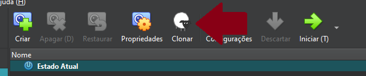
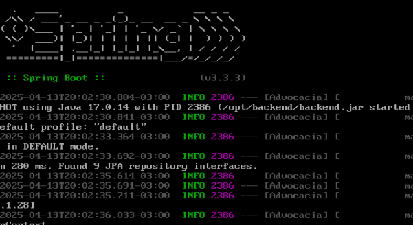
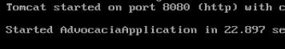
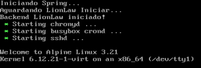
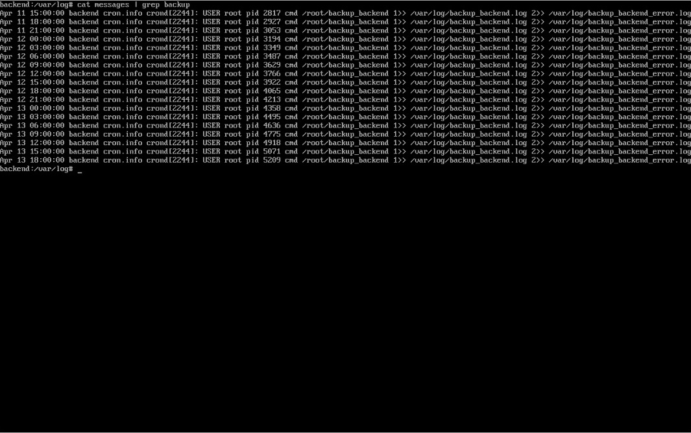

# Configuração da VM Backend

A **VM Backend** é responsável por executar a nossa **API** utilizando o **Java 17**, ela possui um usuário dedicado **backend** que executará o processo, e também um script de inicialização que executará automaticamente ao ligar a máquina virtual.

---

### 1. Clonando a VM Base

Começamos fazendo o clone do tipo completo da **VM base**, que foi criada previamente.  



---

#### 1.1 Configuração da Interface em modo bridge

Para cada VM que clonamos foi necessário atribuir um IP próprio editando o arquivo de interfaces:

```bash
vim /etc/network/interfaces
```

Como a nossa interface em modo bridge é o adaptador 2, ela fica identificada como eth1:

```bash
auto lo
iface lo inet loopback

auto eth0
iface eth0 inet dhcp

auto eth1
iface eth1 inet static
    address 192.168.0.1
    netmask 255.255.255.0
```

Após salvar o arquivo reiniciamos o serviço:

```bash
rc-service networking restart
```

---

### 2. Alterando o Hostname

Para diferenciar a VM Frontend das demais, alteramos seu hostname para **frontend**, editando o arquivo de hostname:

```bash
vim /etc/hostname
```

> As alterações no hostname só têm efeito após um reboot:

---

### 3. Configurando resolução de nome para  os IPs

Para nosso projeto utilizamos o nome `database.llw` para o banco de dados e é através dele que o backend se comunica com a VM de database, então foi necessário alterar o arquivo `hosts`:

```bash
vim /etc/hosts
```

E informamos o IP da database com seu respectivo nome:

```bash
"192.168.0.2" database.llw
```

---

### 3. Instalando o Java 17

Instalamos o Java 17 com o comando:

```bash
apk add openjdk17
```

---
### 4. Buildando o Projeto

No Windows antes de fazer a build do backend, foi necessário configurar corretamente o endereço IP da VM Database junto com o usuário e senha do banco de dados.

Editamos o arquivo **application.properties**:

```typescript
spring.datasource.url=jdbc:mysql://database.llw:3306/adv
spring.datasource.username=advocacia
spring.datasource.password=PePeFaFe!05
```

Depois enviamos o arquivo jar por scp para o diretório `/opt/backend` que criamos na VM:

```bash
scp backend.jar root@192.168.105:/opt/backend/
```

Após esse passo executamos o comando:

```bash
java -jar backend.jar
```





>Como tudo foi configurado corretamente, a aplicação iniciou.

---

### 5. Criando o script para rodar a API automaticamente

Adicionamos um novo usuário chamado `backend` que é o responsável por rodar a aplicação e definimos a home dele em `/opt/backend`:

```bash
adduser -h /opt/backend backend
```

Em seguida dentro do diretório `/etc/init.d /` abrimos um novo arquivo em branco chamado backend:

```bash
vim  /etc/init.d/backend
```

Preenchemos ele com o seguinte script:

```sh
#!/sbin/openrc-run
description="Lionlaw"
java="/usr/bin/java"
arquivo="/opt/backend/backend.jar"
pidfile="/opt/backend/lionlaw.pid"
output_log="/opt/backend/backend.out"
usuario="backend"

depend() {
    need net
    after local
}
start_pre() {
    echo "Iniciando Spring..."
}
start() {
    cd /opt/backend || exit 1
    su -s /bin/sh -c "nohup $java -jar $arquivo > $output_log 2>&1 & echo \$! > $pidfile" $usuario
    echo "Aguardando LionLaw Iniciar..."
    for i in $(seq 1 60); do
        if netstat -tlnp 2>/dev/null | grep -q ":8080 "; then
            echo "Backend LionLaw iniciado!"
            return 0
        fi
        sleep 1
    done
    echo "Falha ao iniciar LionLaw."
    return 1
}
stop() {
    echo "Parando serviço..."
    if [ -f "$pidfile" ]; then
        kill -9 "$(cat $pidfile)" && rm -f "$pidfile"
        echo "LionLaw parado."
    else
        echo "Nenhum serviço rodando na porta 8080."
    fi
}
```

Tornamos o arquivo executável:

```bash
chmod +x /etc/init.d/backend
```

Iniciamos a aplicação e configuramos para que inicie automaticamente:

```bash
service backend start
rc-update add backend 
```

Com essa configuração a aplicação executa automaticamente ao ligar a máquina virtual


---

### 6. Configurando o script de backup

Criamos o arquivo em `/root/`:

```bash
vim /root/backup_backend
```

E preenchemos da seguinte forma: 

```bash
#!/bin/ash
timestamp=$(date '+%Y-%m-%d_%H-%M-%S')
temp_dir="/tmp/backup_backend_$timestamp"
init_script="/etc/init.d/backend"
authorized_keys="/root/.ssh/authorized_keys"
tar_file="/tmp/backup_backend_$timestamp.tar.gz"

remote_user="backup_sys"
remote_host="frontend.llw"
remote_path="/opt/backup/backend"

echo "Criando diretórios temporários, Data: $timestamp"
mkdir -p "$temp_dir" || { echo "Erro ao criar diretório temporário, Data: $timestamp"; exit 1; }

echo "Copiando script de inicialização, Data: $timestamp"
cp "$init_script" "$temp_dir/" || { echo "Erro ao copiar o script backend, Data: $timestamp"; rm -rf "$temp_dir"; exit 1; }

echo "Copiando authorized_keys, Data: $timestamp"
cp "$authorized_keys" "$temp_dir/" || { echo "Erro ao copiar authorized_keys, Data: $timestamp"; rm -rf "$temp_dir"; exit 1; }

echo "Compactando arquivos, Data: $timestamp"
tar -czf "$tar_file" -C "$(dirname "$temp_dir")" "$(basename "$temp_dir")" || { echo "Erro ao compactar, Data: $timestamp"; rm -rf "$temp_dir"; exit 1; }

echo "Enviando backup para $remote_host:$remote_path, Data: $timestamp"
scp "$tar_file" "$remote_user@$remote_host:$remote_path/" || { echo "Erro ao enviar o backup via SCP, Data: $timestamp"; rm -rf "$temp_dir" "$tar_file"; exit 1; }

echo "-> Backup enviado com sucesso, Data: $timestamp"

rm -rf "$temp_dir" "$tar_file"
exit 0
```

#### 6.1 Resolvendo o nome do IP de backup

Escolhemos o nome `frontend.llw`para a **VM Frontend** e para o script funcionar corretamente foi necessário resolver o nome do IP de destino editamos o arquivo `hosts`:

```bash
vim /etc/hosts
```

E informamos o IP do frontend com seu respectivo nome:

```bash
"192.168.0.3" frontend.llw
```

---

## 7. Agendamento de Script Backup com Crontab

Editamos o arquivo de agendamento padrão do Linux Alpine:

```bash
vim /etc/crontabs/root
```

Adicionamos essa linha ao final do arquivo para rodar o script de backup automaticamente a cada 3 horas:

```bash
0 */3 * * * /root/backup_backend 1>> /var/log/backup_backend.log 2>> /var/log/backup_backend_error.log
```

Utilizamos o comando `cat` em `messages` depois do tempo proposto: 

```bash
cat /var/log/messages | grep backup 
```



>Resultado do log do Cron

---