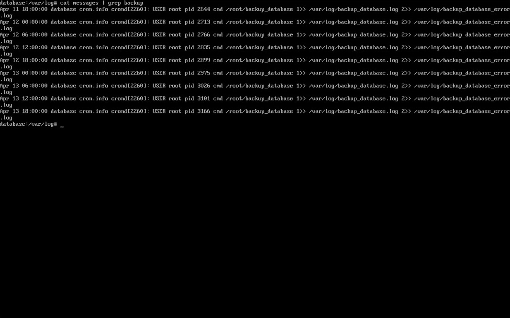

# Configuração da VM Database

A  **VM Database** é responsável por armazenar o banco de dados que será utilizado pela API e o SGBD escolhido para o projeto é o **MariaDB** em conjunto com o **mysql-client**.

---

### 1. Clonando a VM Base

Começamos fazendo o clone do tipo completo da **VM base**, que foi criada previamente.  


---

#### 1.1 Configuração da Interface em modo bridge

Para cada VM que clonamos foi necessário atribuir um IP próprio editando o arquivo de interfaces:

```bash
vim /etc/network/interfaces
```

Como a nossa interface em modo bridge é o adaptador 2, ela fica identificada como eth1:

```bash
auto lo
iface lo inet loopback

auto eth0
iface eth0 inet dhcp

auto eth1
iface eth1 inet static
    address 192.168.0.2
    netmask 255.255.255.0
```

Após salvar o arquivo reiniciamos o serviço:

```bash
rc-service networking restart
```

---

### 2. Alterando o Hostname

Para diferenciar a VM Database das demais, alteramos seu hostname para **database**, editando o arquivo de hostname:

```bash
vim /etc/hostname
```

> As alterações no hostname só têm efeito após um reboot:

---

### 3. Configurando resolução de nome para  os IPs

Para nosso projeto utilizamos o nome `backend.llw` para o backend e é através dele que a VM Database vai saber quem está conectado a ela, por isso editamos o arquivo `hosts`:

```bash
vim /etc/hosts
```

E informamos o IP do backend com seu respectivo nome:

```bash
192.168.0.1 backend.llw
```

---

### 4. Instalando MariaDB

Instalamos o **MariaDB** em conjunto com o **mysql-client**:

```bash
apk add mariadb mysql-client
```

> MariaDB é nosso **SGBD**, mas utilizamos o mysql-client para acessar a base de dados para manutenção e configuração de usuários e permissões.

Rodamos o script de setup do MariaDB:

```bash
/etc/init.d/mariadb setup
```

E editamos o arquivo de configuração:

```bash
vim /etc/my.cnf.d/mariadb-server.cnf
```

Modificamos o arquivo de configurações do mysql:

```bash
[mysqld]
#skip-networking

bind-address=database.llw
port=3306
```

Iniciamos o serviço e configuramos para que inicie automaticamente:

```bash
rc-service mariadb start
rc-update add mariadb
```

> Com esse passo o MariaDB vai rodar sempre que ligarmos VM, e vai receber conexões de todas as interfaces de rede pela porta 3306 que tiverem permissão.

---

### 4. Configurando o ambiente do Banco de Dados

Entramos no mysql-client utilizando o usuário root, sem senha no primeiro acesso:

```bash
mysql -u root
```

Escolhemos uma senha forte para o root:

```sql
ALTER USER 'root'@'localhost' IDENTIFIED BY 'SenhaForte';
```

> Nossa senha do root não será informada na documentação.

Criamos a base de dados utilizada por nossa API:

```sql
create database adv;
```

Em seguida criamos o user mysql que será utilizado pela API para acessar a database:

```sql
CREATE USER 'llw'@'backend.llw' IDENTIFIED BY 'PePeFaFe!05';
GRANT SELECT,INSERT,UPDATE,DELETE ON adv.* TO 'llw'@'backend.llw';
```

> Na primeira execução foi dada a permissão de CREATE, porém após a criação das tabelas removemos a permissão com REVOKE. 

---

### 6. Configurando o script de backup

Criamos o arquivo em `/root/`:

```bash
vim /root/backup_database
```

E preenchemos da seguinte forma: 

```bash
#!/bin/ash
timestamp=$(date '+%Y-%m-%d_%H-%M-%S')
temp_dir="/tmp/backup_database_$timestamp"
dump_file="/tmp/lionlaw_$timestamp.sql"
ssh_key="/root/.ssh/authorized_keys"
tar_file="/tmp/backup_database_$timestamp.tar.gz"
remote_user="backup_sys"
remote_host="frontend.llw"
remote_path="/opt/backup/database"
db_user="USER"
db_pass="SENHA"
db_name="adv"

echo "Criando diretório temporário, Data: $timestamp"
mkdir -p "$temp_dir" || { echo "Erro ao criar diretório temporário, Data: $timestamp"; exit 1; }

echo "Realizando dump do banco de dados, , Data: $timestamp"
mariadb-dump -u"$db_user" -p"$db_pass" "$db_name" > "$dump_file" || { echo "Erro ao gerar o dump, Data: $timestamp"; rm -rf "$temp_dir" "$dump_file"; exit 1; }

echo "Copiando dump do banco de dados, Data: $timestamp"
cp "$dump_file" "$temp_dir/" || { echo "Erro ao dump do banco de dados, Data: $timestamp"; rm -rf "$temp_dir" "$dump_file"; exit 1; }


cp "$ssh_key" "$temp_dir/" || { echo "Erro ao copiar authorized_keys, Data: $timestamp"; rm -rf "$temp_dir" "$dump_file"; exit 1; }

echo "Compactando tudo, Data: $timestamp"
tar -czf "$tar_file" -C "$(dirname "$temp_dir")" "$(basename "$temp_dir")" || { echo "Erro ao compactar arquivos, Data: $timestamp"; rm -rf "$temp_dir" "$dump_file"; exit 1; }

echo "Enviando para $remote_user@$remote_host:$remote_path, Data $timestamp"
scp "$tar_file" "$remote_user@$remote_host:$remote_path/" || { echo "Erro ao enviar o backup via SCP, Data: $timestamp"; rm -rf "$temp_dir" "$dump_file" "$tar_file"; exit 1; }

echo "-> Backup enviado com sucesso, Data: $timestamp"

rm -rf "$temp_dir" "$dump_file" "$tar_file"
exit 0
```

E por fim tornamos o arquivo executável:

```bash
chmod +x /root/backup_database
```

#### 6.1 Resolvendo o nome do IP de backup

Escolhemos o nome `frontend.llw`para a **VM Frontend** e para o script funcionar corretamente foi necessário resolver o nome do IP de destino:

editamos o arquivo `hosts`:

```bash
vim /etc/hosts
```

E informamos o IP do frontend com seu respectivo nome:

```bash
"192.168.0.3" frontend.llw
```

---

## 7. Agendamento de Script Backup com Crontab

Editamos o arquivo de agendamento padrão do Linux Alpine:

```bash
vim /etc/crontabs/root
```

Adicionamos essa linha ao final do arquivo para rodar o script de backup automaticamente a cada 6 horas:

```bash
0 */6 * * * /root/backup_database 1>> /var/log/backup_database.log 2>> /var/log/backup_database_error.log
```

Utilizamos o comando `cat` em `messages` depois do tempo proposto: 

```bash
cat /var/log/messages | grep backup 
```



>Resultado do log do Cron

---