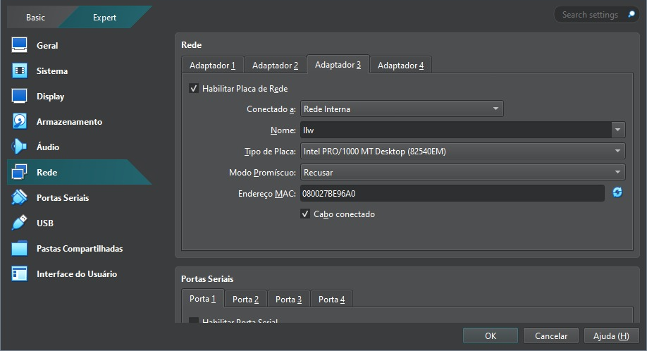

## 1. Rede Interna

### 1.1 Configuração de Rede nas VMs

Alteramos o **Adaptador 2** das VMs Backend e Database para `Rede Interna` e nomeamos a rede como llw


Para a VM Frontend incluímos um terceiro adaptador como `rede interna` e também nomeamos como llw



### 1.2 Configuração dos IPs 

O IP escolhido para a rede interna foi 10.10.10.0/29, então foi necessário configurar o arquivo `interfaces` e o arquivo de `hosts` das VMs. 

Em cada uma delas usamos o comando de editar o arquivo 

```bash
vim /etc/network/interfaces 
```

VM Frontend 

```bash
auto lo
iface lo inet loopback

auto eth0
iface eth0 inet dhcp

auto eth1
iface eth1 inet static
    address 192.168.0.3
    netmask 255.255.255.0

auto eth2
iface eth2 inet static
    address 10.10.10.3
    netmask 255.255.255.248
    network 10.10.10.0 
```

VM Backend 

```bash
auto lo
iface lo inet loopback

auto eth0
iface eth0 inet dhcp

auto eth1
iface eth1 inet static
    address 10.10.10.1
    netmask 255.255.255.248
    network 10.10.10.0
```

VM Database 

```bash
auto lo
iface lo inet loopback

auto eth0
iface eth0 inet dhcp

auto eth1
iface eth1 inet static
    address 10.10.10.2
    netmask 255.255.255.248
    network 10.10.10.0
```

E para os hosts usamos o comando de edição do arquivo:

```bash
vim /etc/hosts 
```

Resolvemos os nomes para os IPs da rede interna:

```bash
10.10.10.1 backend.llw
10.10.10.2 database.llw
10.10.10.3 frontend.llw
```

### 2.3 Configuração do nginx 

Editamos o arquivo de configuração do nginx para configurar o **proxy reverso**:

```bash
vim /etc/nginx/http.d/default.conf
```

O arquivo foi editado com essas informações:

```bash 
server {
    listen 80;
    listen 8080;
    listen [::]:80;

    server_name backend.llw;

    access_log /var/log/nginx/frontend_access.log;
    error_log /var/log/nginx/frontend_error.log;

    location / {
        root /opt/frontend;
        index index.html;
        try_files $uri $uri/ /index.html;
    }

    location /api/ {
        proxy_pass http://backend.llw:8080;
        proxy_http_version 1.1;
        proxy_set_header Host $host;
        proxy_set_header X-Real-IP $remote_addr;
        proxy_set_header X-Forwarded-For $proxy_add_x_forwarded_for;
        proxy_set_header X-Forwarded-Proto $scheme;
        proxy_pass_request_headers on;
        proxy_pass_request_body on;
    }

    location = /404.html {
        internal;
    }
}
```


## 2. Firewall

Utilizamos iptables para bloquear todos o acesso às portas inutilizadas.

Instalamos iptables em todas as VMs: 

```bash
apk add iptables
```

Adicionamos as seguintes regras de tráfego:

```bash
iptables -P INPUT DROP
```

```bash
iptables -P OUTPUT ACCEPT
```

```bash
iptables -P FORWARD DROP
```

Colocamos o iptables para iniciar no boot:

```bash
rc-service add iptables boot
```

Salvamos as regras do iptables no `init.d`:

```bash
/etc/init.d/iptables save
```

--- 

### 2.1 Excessões VM Database

```bash
iptables -A INPUT -p tcp -s backend.llw -d database.llw --dport 3306 -j ACCEPT
```

```bash
iptables -A INPUT -m state --state ESTABLISHED,RELATED -j ACCEPT
```

---

### 2.2 Excessões VM Backend

```bash
iptables -A INPUT -p tcp -s frontend.llw -d backend.llw --dport 8080 -j ACCEPT
```

```bash
iptables -A INPUT -m state --state ESTABLISHED,RELATED -j ACCEPT
```

### 2.3 Excessões VM Frontend

```bash
iptables -A INPUT -p tcp --dport 80 -j ACCEPT
```

```bash
iptables -A INPUT -p tcp --dport 8080 -j ACCEPT
```

```bash
iptables -A INPUT -p tcp -s backend.llw -d frontend.llw --dport 22 -j ACCEPT
```

```bash
iptables -A INPUT -p tcp -s database.llw -d frontend.llw --dport 22 -j ACCEPT
```
 
```bash
iptables -A INPUT -m state --state ESTABLISHED,RELATED -j ACCEPT
```

---

## 3. Permissões do MariaDB 

> Essa configuração foi mostrada anteriormente no capítulo de Database, mas adicionada a essa sessão por também fazer parte de um tópico extra.

Passamos apenas permissões necessárias para o usuário mysql do backend, impedindo que ele realize o **DROP** de tabelas por exemplo:

```bash
GRANT SELECT,INSERT,UPDATE,DELETE ON adv.* TO 'llw'@'backend.llw';
```

---