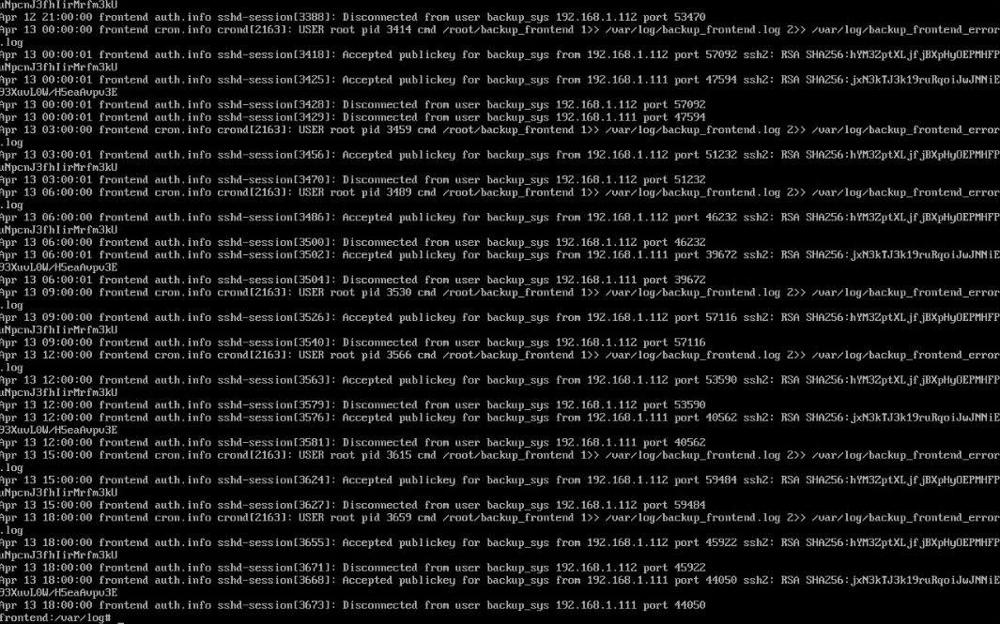

# Configuração da VM Frontend

A **VM Frontend** é responsável por hospedar a interface do sistema utilizando o servidor web **nginx**, e também atua como **servidor de backups**, armazenando os arquivos de backup de todas as outras VMs, incluindo ela mesma. Por esse motivo, ela possui um arquivo **authorized_kyes** com a **chave pública rsa** de cada uma das outras máquinas virtuais em seu usuário **backup_sys**, permitindo que os arquivos de backup sejam recebidos via scp.

---

### 1. Clonando a VM Base

Começamos fazendo o clone do tipo completo da **VM base**, que foi criada previamente.  


---

#### 1.1 Configuração da Interface em modo bridge

Para cada VM que clonamos foi necessário atribuir um IP próprio editando o arquivo de interfaces:

```bash
vim /etc/network/interfaces
```

Como a nossa interface em modo bridge é o adaptador 2, ela fica identificada como eth1:

```bash
auto lo
iface lo inet loopback

auto eth0
iface eth0 inet dhcp

auto eth1
iface eth1 inet static
    address 192.168.0.3
    netmask 255.255.255.0
```

Após salvar o arquivo reiniciamos o serviço:

```bash
rc-service networking restart
```

---

### 2. Alterando o Hostname

Para diferenciar a VM Frontend das demais, alteramos seu hostname para **frontend**, editando o arquivo de hostname:

```bash
vim /etc/hostname
```

> As alterações no hostname só têm efeito após um reboot:

---

### 3. Configurando resolução de nome para  os IPs

Para nosso projeto utilizamos o nome `backend.llw` para o backend e é através dele que o frontend realiza requisições, então foi necessário alterar o arquivo `hosts`:

```bash
vim /etc/hosts
```

E informamos o IP do backend com seu respectivo nome:

```{bash}
"192.168.0.1" backend.llw
```

---

### 4. Arquivo Hosts no Windows

Editamos o arquivo hosts do Windows com permissões de administrador que fica localizado no seguinte diretório:

```bash
C:\Windows\System32\drivers\etc\hosts
```

E informamos o IP do backend com seu respectivo nome assim como fizemos na VM:

```bash
192.168.1.106 backend.llw
```

---

### 5. Instalando o Nginx

Instalamos o servidor web nginx:

```bash
apk add nginx
```

Iniciamos o serviço e configuramos para que inicie automaticamente:

```bash
rc-service nginx start
rc-update add nginx
```

---

### 6. Configurando o Nginx

Editamos o arquivo de configuração do nginx:

```bash
vim /etc/nginx/http.d/default.conf
```

Adicionamos logs de acesso e de erros no arquivo:

```bash
access_log /var/log/nginx/frontend_access.log;
error_log /var/log/nginx/frontend_error.log;
```

Indicamos o caminho onde os nossos arquivos estáticos de frontend estão localizados:

```bash
location / {
    root /opt/frontend;
    index index.html;
    try_files $uri $uri/ /index.html;
}
```

E recarregamos o nginx para confirmar as alterações:

````bash
nginx -s reload
````

---

### 7. Buildando o Frontend

No Windows antes de fazer o build do frontend, foi necessário configurar corretamente o endereço IP da **API Backend**. 

Editamos o arquivo `environment.server.ts` do angular:

```typescript
export const environment = {
  production: true,
  apiUrl: 'http://backend.llw:8080'
};
```

Realizamos o **build** e compactamos os arquivos em um .zip, para só então realizar o envio via scp para a VM no diretório que criamos em `/opt/frontend`

```bash
scp site.zip root@192.168.1.105:/opt/frontend/
```

Já na VM descompactamos o arquivo usando o comando:

```bash
unzip site.zip
```

> Com esse passo já foi possível visualizar a tela inicial do projeto utilizando o ip da VM Frontend no navegador.


---

### 8. Preparando o ambiente para o backup

Criamos um diretório para armazenar os backups:

```bash
mkdir /opt/backup/
```

Em seguida diretórios que separam os backups buscando organizar os arquivos:

```bash
mkdir /opt/backup/frontend/
mkdir /opt/backup/backend/
mkdir /opt/backup/database/
```

E por fim adicionamos um novo usuário chamado `backup_sys` definindo a home dele dentro do diretório de backups:

```bash
adduser -h /opt/backup backup_sys
```

### 9. Recebendo as chaves RSA das outras VM's:

#### 9.1 Criando o par de chaves

Na VM **Backend** e **Database** criamos as chaves RSA:

```bash
ssh-keygen -t rsa -b 4096 -f id_rsa
```

E na VM Frontend editamos o arquivo de configuração do ssh: 

```bash
vim /etc/ssh/sshd_config
```

Permitimos o login com senha provisoriamente, apenas para conseguirmos enviar a chave pública:

```bash 
PasswordAuthentication yes
```

Reiniciamos o serviço para aplicar as configurações:

```bash
rc-service sshd restart
```

#### 9.2 Enviando a chave pública para backup_sys

Enviamos a chave pública da VM Backend para o backup_sys modificando o nome para `authorized_keys`:

```bash
scp id_rsa.pub backup_sys@frontend.llw:/opt/backup/.ssh/authorized_keys
```

Em seguida enviamos a chave pública da VM Database para o backup_sys, mas sem dar um nome diferente para a chave:

```bash
scp id_rsa.pub backup_sys@frontend.llw:/opt/backup/.ssh/
```

Na VM **Frontend**, utilizamos o comando cat para adicionar a segunda chave pública no final do arquivo **authorized_keys**:

```bash
cat /opt/backup/.ssh/id_rsa.pub >> /opt/backup/.ssh/authorized_keys
```

Apagamos o arquivo id_rsa.pub que ficou sobrando:

```bash
rm /opt/backup/.ssh/id_rsa.pub
```

Modificamos as permissões da chave:

```bash
chmod 600 /opt/backup/.ssh/authorized_keys
```

E alteramos o proprietário dessa pasta .ssh localizada em `/opt/backup`:

```bash
chown -R backup_sys:backup_sys /opt/backup/.ssh
```

#### 9.3 Retirando a autenticação por senha

Por fim editamos novamente o `sshd_config`, dessa vez para impedir o acesso por senha:

```bash
PasswordAuthentication no
```

E reiniciamos o serviço para aplicar as configurações uma última vez:

```bash
rc-service sshd restart
```

---

### 10. Configurando o script de backup local

Criamos o arquivo em `/root/`:

```bash
vim /root/backup_front
```

E preenchemos da seguinte forma: 

```sh
#!/bin/sh
timestamp=$(date '+%Y-%m-%d_%H-%M-%S')
temp_dir="/tmp/backup_front_$timestamp"
front_dir="$temp_dir/front"
front_end="/opt/frontend"
authorized_keys="/root/.ssh/authorized_keys"
tar_file="/opt/backup/frontend/backup_front_$timestamp.tar.gz"

echo "Criando diretórios temporários, Data: $timestamp"
mkdir -p "$front_dir" || { echo "Erro ao criar diretório temporário, Data: $timestamp"; exit 1; }

echo "Copiando arquivos do frontend, Data: $timestamp"
cp -r "$front_end/"* "$front_dir/" || { echo "Erro ao copiar arquivos do frontend, Data: $timestamp"; rm -rf "$temp_dir"; exit 1; }

echo "Copiando authorized_keys, Data: $timestamp"
cp "$authorized_keys" "$temp_dir/" || { echo "Erro ao copiar authorized_keys, Data: $timestamp"; rm -rf "$temp_dir"; exit 1; }

echo "Compactando tudo, Data: $timestamp"
tar -czf "$tar_file" -C "$(dirname "$temp_dir")" "$(basename "$temp_dir")" || { echo "Erro ao compactar, Data: $timestamp"; rm -rf "$temp_dir"; exit 1; }

echo "-> Backup criado com sucesso, Data: $timestamp "

rm -rf "$temp_dir"
exit 0
```

E por fim tornamos o arquivo executável:

```bash
chmod +x /root/backup_front
```

---

## 11. Agendamento de Script Backup com Crontab

Editamos o arquivo de agendamento padrão do Linux Alpine:

```bash
vim /etc/crontabs/root
```

Adicionamos essa linha ao final do arquivo para rodar o script de backup automaticamente a cada 3 horas:

````bash
0 */3 * * * /root/backup_front 1>> /var/log/backup_front.log 2>> /var/log/backup_front_error.log
````

Utilizamos o comando `cat` em `messages` depois do tempo proposto: 

```bash
cat /var/log/messages | grep backup 
```


>Resultado do log do Cron

---