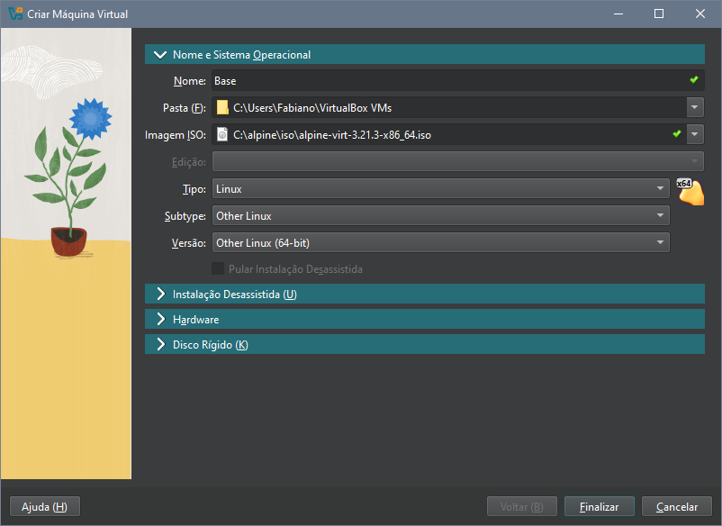
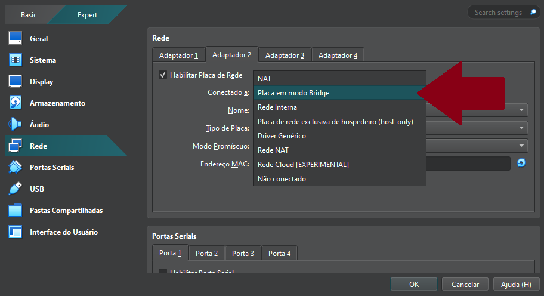

# Instalação e Configuração do Alpine Linux no VirtualBox (VM Base)

Este documento explica passo a passo a configuração realizada na **VM Base**, e serve como template para as máquinas virtuais criadas posteriormente, com a possibilidade de clonar essa base, evitamos a necessidade de refazer configurações que são comuns a todas elas. Permitindo que o foco fique em configurar apenas o necessário para que determinada máquina virtual cumpra o objetivo para o qual foi criada, seja Frontend, Backend, Database ou qualquer possibilidade que possa surgir futuramente. 

---

## 1. Download dos Recursos Necessários

Começamos com o download e instalação de um **hypervisor**, um software que permite executar várias máquinas virtuais em uma única máquina física. A escolha para esse projeto foi o **Oracle VirtualBox**.

Em seguida  fizemos o download da  **ISO do Alpine Linux**, em sua versão virtual, que dispensa interface gráfica, contando apenas com o Bash, uma interface de linha de comando (CLI) usada para interpretar comandos.

---

## 2. Criação da Máquina Virtual

Após instalar o VirtualBox e baixar a ISO do Alpine, criamos a máquina **máquina virtual (VM)** com as seguintes especificações:

- **CPU**: 1 core  
- **RAM**: 512 MB  
- **Disco**: 20 GB  
- **ISO de Boot**: Alpine Linux (modo virtual)



---

## 3. Ajustes Iniciais da VM

### Configuração de Rede

Adicionamos uma nova **interface de rede em modo Bridge**, para permitir que a VM se conecte a outros dispositivos na mesma rede, como se fosse um dispositivo físico separado.



---

## 4. Boot e Setup do Alpine Linux

Ao iniciar pela primeira vez, utilizamos o login com root sem informar senha:

- **Login**: `root`  
- **Senha**: *(vazio)*

E o seguinte comando para iniciar a instalação do **Alpine Linux**:

```bash
setup-alpine
```

---

## 5. Configurações do Setup do Alpine Linux

Essas foram nossas escolhas para configurar a VM base, mas elas podem ser alteradas mais tarde dependendo da necessidade de cada tipo de VM.

- **Layout de Teclado**: `br-br`  
- **Hostname**: `localhost`  
- **Interfaces de Rede**: `eth0 (NAT)`, `eth1 (Bridge)`  
- **Endereço IP**: `DHCP`  
- **Configuração Manual da Interface**: `n`  
- **Senha do usuário root**: `root`  
- **Fuso Horário**: `America/Sao_Paulo`  
- **Proxy**: `none`  
- **NTP**: `chrony`  
- **Repositório (Mirror)**: `1`  
- **Criar um usuário comum**: `n`  
- **Servidor SSH**: `openssh`  
- **Permitir login root via SSH**: `prohibit-password`  
- **Chave SSH para root**: `none`  
- **Disco selecionado**: `sda`  
- **Modo de uso do disco**: `sys`  
- **Apagar dados do disco**: `y`

---

## 6. Finalizando a Instalação

Após concluir o processo de instalação, desligamos a máquina virtual:

```bash
poweroff
```

> Removemos o dispositivo que contém ISO do Alpine, pois o sistema já foi instalado no disco rígido.

---

## 7. Gerenciamento de Pacotes

### 7.1 Habilitando Repositórios da Comunidade

Abrimos o arquivo **repositories** em modo de edição:

```bash
vi /etc/apk/repositories
```

Removemos o `#` na frente do link para habilitar o repositório `community`, que possui pacotes utilizados em nosso projeto.

```bash
http://dl-cdn.alpinelinux.org/alpine/v3.19/community
```

### 7.2 Atualizando o Sistema

Executamos os comandos para atualização dos pacotes: 

O primeiro lista os pacotes disponíveis nos repositórios:

```bash
apk update
```

O segundo atualiza os pacotes instalados em caso de existirem atualizações:

```bash
apk upgrade
```

### 7.3 Instalando um Editor de Texto Alternativo

Parte do nosso grupo utilizou o editor de texto nano e parte utilizou o vim, para essa documentação os exemplos serão com vim: 

```bash
apk add vim
```

---

## 8. Melhorando a integração com o host 

Instalamos o  **VirtualBox Guest Additions** para melhorar a integração com o host:

```bash
apk add virtualbox-guest-additions
```

Em seguida iniciamos o serviço e configuramos para que inicie automaticamente:

```bash
rc-service virtualbox-guest-additions start
rc-update add virtualbox-guest-additions
```

---

## 9. Configurando Acesso SSH

Editamos o arquivo de configuração do SSH para permitir o acesso por senha temporariamente:

```bash
vim /etc/ssh/sshd_config
```

Alteramos duas linhas para permitir conexão ssh com root e para permitir login com senha:

```bash
PermitRootLogin yes
PasswordAuthentication yes
```

E reiniciamos o serviço para confirmar as alterações:

```bash
rc-service sshd restart
```

---

## 10. Acesso via Chave SSH

### 10.1 Gerando Chave no Host

No powershell do **Windows** geramos um par de chaves:

```powershell
ssh-keygen -t rsa -b 4096 -f id_rsa
```

> No momento de gerar as chaves deixamos o campo de senha vazio.

---

### 10.2 Preparando a VM para Receber a Chave

Na **VM** criamos o diretório .ssh:

```bash
mkdir /root/.ssh
```

E no **Windows** enviamos a chave pública para a pasta .ssh da **VM** via scp:

```powershell
scp .ssh/id_rsa.pub root@192.168.1.108:/root/.ssh/authorized_keys
```

Ajustamos as permissões do arquivo enviado:

```bash
chmod 600 /root/.ssh/authorized_keys
```

e em seguida testamos a conexão:

```bash
ssh root@192.168.1.108
```

---

### 10.3 Desabilitando Acesso por Senha

Editamos novamente o `sshd_config`, dessa vez para impedir o acesso por senha:

```bash
PasswordAuthentication no
```

E reiniciamos o serviço para aplicar as configurações:

```bash
rc-service sshd restart
```

> A partir deste ponto, o acesso à VM será feito **exclusivamente via chave SSH** e sem utilização de senha.

---