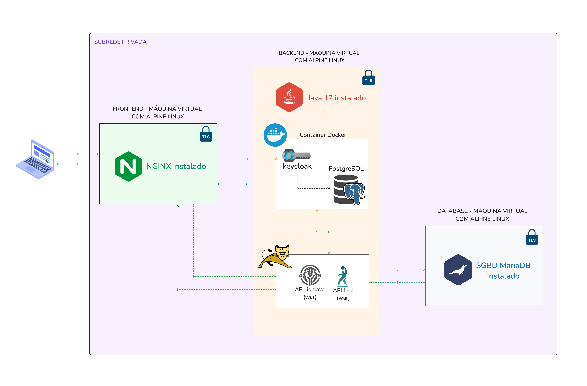

Essa documentação vai passar pelos passos necessários para implementação da autenticação com keycloak.

## Diagrama de arquitetura do ambiente.



## Adaptando API para rodar com keycloak no angular

### Instalando o pacote (no angular)

````bash
npm install keycloak-js
````

### Iniciando o keycloak junto com o angular, main.ts

````typescript
export function kcFactory(kcService: KeycloakService) {
  return () => kcService.init();
}

bootstrapApplication(AppComponent, {
  providers: [
    KeycloakService,
    {
      provide: APP_INITIALIZER,
      useFactory: kcFactory,
      deps: [KeycloakService],
      multi: true,
    },
    provideRouter(routes),
    provideHttpClient(withInterceptors([authInterceptor])),
  ],
});
````

### Service do keycloak

````typescript
export class KeycloakService {
  private keycloak: Keycloak | undefined;
  private profile: UserProfile | undefined;

  get getKeycloak() {
    if (!this.keycloak) {
      this.keycloak = new Keycloak({
        url: 'https://frontend.llw/',
        realm: 'main_realm',
        clientId: 'lionlaw',
      });
    }
    return this.keycloak;
  }

  get getProfile() {
    return this.profile;
  }

  getRoute(path: string): string {
    if (this.profile && this.profile.role === 'ADMIN') {
      return `/admin/${path}`;
    } else {
      return `/user/${path}`;
    }
  }

  async init() {
  console.log('Autenticando Usuário');
  const authenticated = await this.getKeycloak?.init({
    onLoad: 'login-required',
  });

  if (authenticated) {
    console.log('Usuário autenticado');
    this.profile = (await this.keycloak?.loadUserProfile() as UserProfile);
    this.profile.token = this.keycloak?.token;

    const clientRoles = this.keycloak?.resourceAccess?.['llw']?.roles;

    if (clientRoles?.includes('ADMIN')) {
      this.profile.role = 'ADMIN';
    } else {
      this.profile.role = 'USER';
    }
  }
}

  login() {
    return this.keycloak?.login();
  }

  logout() {
    return this.keycloak?.logout();
  }
}
````

### HTTP interceptor

````typescript
export const authInterceptor: HttpInterceptorFn = (req, next) => {
  const token = inject(KeycloakService).getKeycloak?.token;

  if (token) {
    req = req.clone({
      setHeaders: {
        Authorization: `Bearer ${token}`,
      },
    });
  }

  return next(req);
};
````

### Auth Guard

````typescript
export const authGuard: CanActivateFn = () => {
  const keycloak = inject(KeycloakService).getKeycloak;
  return keycloak?.authenticated ?? false;
};
````

### User profile

````typescript
export interface UserProfile {
  id?: string;
  username?: string;
  email?: string;
  firstName?: string;
  lastName?: string;
  token?: string;
  role?: string;
}
````

## Adaptações para rodar com Keycloak Spring boot

### SecurityConfig

````java

@Configuration
@EnableWebSecurity
public class SecurityConfig {

  @Bean
  public SecurityFilterChain securityFilterChain(HttpSecurity http) throws Exception {
    http
      .csrf(AbstractHttpConfigurer::disable)
      .cors(AbstractHttpConfigurer::disable)
      .authorizeHttpRequests((requests) -> requests
        .anyRequest().authenticated()
      )
      .oauth2ResourceServer(oauth2 -> oauth2.jwt())
      .sessionManagement(session -> session.sessionCreationPolicy(SessionCreationPolicy.STATELESS));

    return http.build();
  }

  @Bean
  public FilterRegistrationBean<CorsFilter> corsFilter() {
    UrlBasedCorsConfigurationSource source = new UrlBasedCorsConfigurationSource();
    CorsConfiguration config = new CorsConfiguration();
    config.setAllowCredentials(true);
    config.setAllowedOriginPatterns(Arrays.asList("*"));
    config.setAllowedHeaders(Arrays.asList(HttpHeaders.AUTHORIZATION, HttpHeaders.CONTENT_TYPE, HttpHeaders.ACCEPT));
    config.setAllowedMethods(Arrays.asList(HttpMethod.GET.name(), HttpMethod.POST.name(), HttpMethod.PUT.name(), HttpMethod.DELETE.name()));
    config.setMaxAge(3600L);
    source.registerCorsConfiguration("/**", config);
    FilterRegistrationBean<CorsFilter> bean = new FilterRegistrationBean<>(new CorsFilter(source));
    bean.setOrder(-102);
    return bean;
  }
}
````

### Aplication Properties

````properties
spring.security.oauth2.resourceserver.jwt.issuer-uri=https://frontend.llw/realms/main_realm
````

> Nosso keycloak está no back mas ele ainda tem que mandar pro front que é o ISSUER aceito no token

## Adaptações nas VM

### Adaptação no proxy reverso (front)

````nginx
location /realms {
        proxy_pass https://backend.llw:8443;
        proxy_http_version 1.1;
        proxy_set_header Host $host;
        proxy_set_header X-Real-IP $remote_addr;
        proxy_set_header X-Forwarded-For $proxy_add_x_forwarded_for;
        proxy_set_header X-Forwarded-Proto $scheme;
        proxy_pass_request_headers on;
        proxy_pass_request_body on;
    }

    location /resources {
        proxy_pass https://backend.llw:8443/resources;
        proxy_http_version 1.1;
        proxy_set_header Host $host;
        proxy_set_header X-Real-IP $remote_addr;
        proxy_set_header X-Forwarded-For $proxy_add_x_forwarded_for;
        proxy_set_header X-Forwarded-Proto $scheme;
        proxy_pass_request_headers on;
        proxy_pass_request_body on;
    }
````
### Instalando docker (backend)

````bash
apk add docker docker-compose
````

### Iniciando ao ligar VM

````bash
rc-update add docker default
````

### DOCKER

````yml
services:
  postgres:
    image: postgres:16
    container_name: keycloak_postgres
    environment:
      POSTGRES_DB: keycloak
      POSTGRES_USER: keycloak
      POSTGRES_PASSWORD: keycloak
    volumes:
      - postgres_data:/var/lib/postgresql/data
    restart: unless-stopped

  keycloak:
    image: quay.io/keycloak/keycloak:latest
    container_name: keycloak
    command: start --https-port=8443
    ports:
      - "8443:8443"
    environment:
      KEYCLOAK_ADMIN: admin
      KEYCLOAK_ADMIN_PASSWORD: admin
      KC_DB: postgres
      KC_DB_URL: jdbc:postgresql://postgres:5432/keycloak
      KC_DB_USERNAME: keycloak
      KC_DB_PASSWORD: keycloak
      KC_HOSTNAME_STRICT: "false"

      KC_HTTPS_CERTIFICATE_FILE: /certs/llw.crt
      KC_HTTPS_CERTIFICATE_KEY_FILE: /certs/llw.key

    volumes:
      - keycloak_data:/opt/keycloak/data
      - ./llw.crt:/certs/llw.crt:ro
      - ./llw.key:/certs/llw.key:ro
    depends_on:
      - postgres
    restart: unless-stopped

volumes:
  postgres_data:
  keycloak_data:
````

### Rodando o container

````bash
docker-compose up -d
````

### Adaptando iptables (front)

````bash
iptables -A INPUT -p tcp --dport 443 -j ACCEPT
````
> Removemos as permissões de 8080 que era a conexão antiga e liberamos 443, que é a padrão para https.

### Adaptando iptables (back)

````bash
iptables -A INPUT -p tcp -s frontend.llw -d backend.llw --dport 443 -j ACCEPT
iptables -A INPUT -p tcp -s frontend.llw -d backend.llw --dport 8443 -j ACCEPT
````

>No back tambem, mas agora recebemos conexões 443 apenas do front e 8443 para o keycloak.

