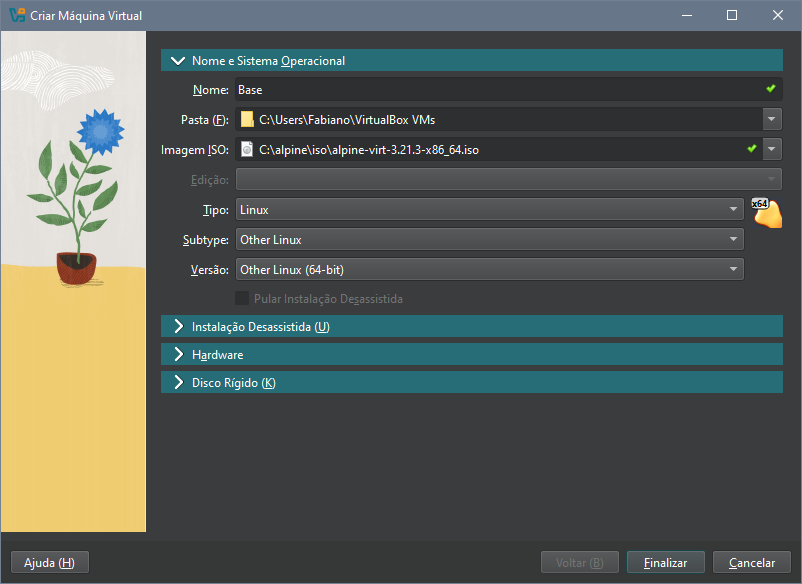
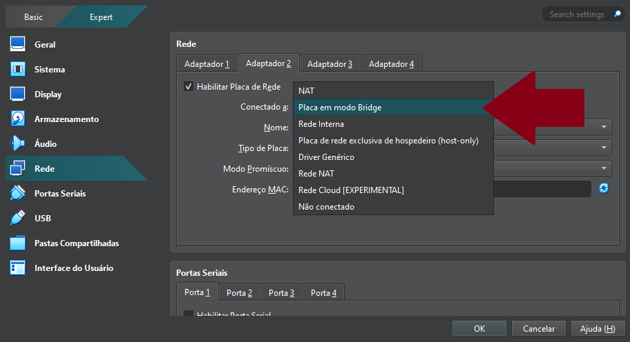
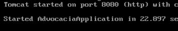
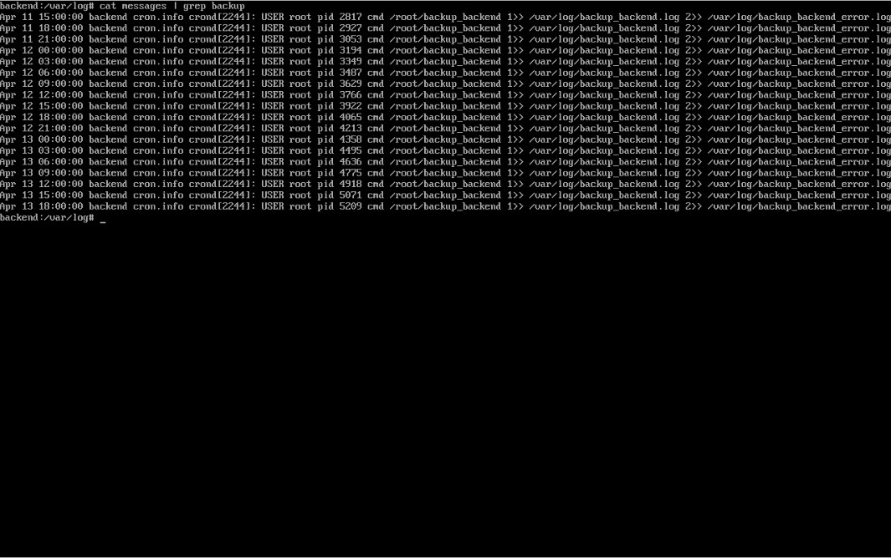

# Implementação de Infraestrutura Segura e Automatizada

## 1. Instalação e Configuração do Alpine Linux no VirtualBox (VM Base)

Este documento explica passo a passo a configuração realizada na **VM Base**, e serve como template para as máquinas virtuais criadas posteriormente, com a possibilidade de clonar essa base, evitamos a necessidade de refazer configurações que são comuns a todas elas. Permitindo que o foco fique em configurar apenas o necessário para que determinada máquina virtual cumpra o objetivo para o qual foi criada, seja Frontend, Backend, Database ou qualquer possibilidade que possa surgir futuramente. 

---

### 1.1 Download dos Recursos Necessários

Começamos com o download e instalação de um **hypervisor**, um software que permite executar várias máquinas virtuais em uma única máquina física. A escolha para esse projeto foi o **Oracle VirtualBox**.

Em seguida  fizemos o download da  **ISO do Alpine Linux**, em sua versão virtual, que dispensa interface gráfica, contando apenas com o Bash, uma interface de linha de comando (CLI) usada para interpretar comandos.

---

### 1.2 Criação da Máquina Virtual

Após instalar o VirtualBox e baixar a ISO do Alpine, criamos a máquina **máquina virtual (VM)** com as seguintes especificações:

- **CPU**: 1 core  
- **RAM**: 512 MB  
- **Disco**: 20 GB  
- **ISO de Boot**: Alpine Linux (modo virtual)



---

### 1.3 Ajustes Iniciais da VM

### 1.4 Configuração de Rede

Adicionamos uma nova **interface de rede em modo Bridge**, para permitir que a VM se conecte a outros dispositivos na mesma rede, como se fosse um dispositivo físico separado.



---

### 1.5 Boot e Setup do Alpine Linux

Ao iniciar pela primeira vez, utilizamos o login com root sem informar senha:

- **Login**: `root`  
- **Senha**: *(vazio)*

E o seguinte comando para iniciar a instalação do **Alpine Linux**:

```bash
setup-alpine
```

---

### 1.6 Configurações do Setup do Alpine Linux

Essas foram nossas escolhas para configurar a VM base, mas elas podem ser alteradas mais tarde dependendo da necessidade de cada tipo de VM.

- **Layout de Teclado**: `br-br`  
- **Hostname**: `localhost`  
- **Interfaces de Rede**: `eth0 (NAT)`, `eth1 (Bridge)`  
- **Endereço IP**: `DHCP`  
- **Configuração Manual da Interface**: `n`  
- **Senha do usuário root**: `root`  
- **Fuso Horário**: `America/Sao_Paulo`  
- **Proxy**: `none`  
- **NTP**: `chrony`  
- **Repositório (Mirror)**: `1`  
- **Criar um usuário comum**: `n`  
- **Servidor SSH**: `openssh`  
- **Permitir login root via SSH**: `prohibit-password`  
- **Chave SSH para root**: `none`  
- **Disco selecionado**: `sda`  
- **Modo de uso do disco**: `sys`  
- **Apagar dados do disco**: `y`

---

### 1.7 Finalizando a Instalação

Após concluir o processo de instalação, desligamos a máquina virtual:

```bash
poweroff
```

> Removemos o dispositivo que contém ISO do Alpine, pois o sistema já foi instalado no disco rígido.

---

### 1.8 Gerenciamento de Pacotes

#### 1.8.1 Habilitando Repositórios da Comunidade

Abrimos o arquivo **repositories** em modo de edição:

```bash
vi /etc/apk/repositories
```

Removemos o `#` na frente do link para habilitar o repositório `community`, que possui pacotes utilizados em nosso projeto.

```bash
http://dl-cdn.alpinelinux.org/alpine/v3.19/community
```

#### 1.8.2 Atualizando o Sistema

Executamos os comandos para atualização dos pacotes: 

O primeiro lista os pacotes disponíveis nos repositórios:

```bash
apk update
```

O segundo atualiza os pacotes instalados em caso de existirem atualizações:

```bash
apk upgrade
```

#### 1.8.3 Instalando um Editor de Texto Alternativo

Parte do nosso grupo utilizou o editor de texto nano e parte utilizou o vim, para essa documentação os exemplos serão com vim: 

```bash
apk add vim
```

---

### 1.9 Melhorando a integração com o host 

Instalamos o  **VirtualBox Guest Additions** para melhorar a integração com o host:

```bash
apk add virtualbox-guest-additions
```

Em seguida iniciamos o serviço e configuramos para que inicie automaticamente:

```bash
rc-service virtualbox-guest-additions start
rc-update add virtualbox-guest-additions
```

---

### 1.10 Configurando Acesso SSH

Editamos o arquivo de configuração do SSH para permitir o acesso por senha temporariamente:

```bash
vim /etc/ssh/sshd_config
```

Alteramos duas linhas para permitir conexão ssh com root e para permitir login com senha:

```bash
PermitRootLogin yes
PasswordAuthentication yes
```

E reiniciamos o serviço para confirmar as alterações:

```bash
rc-service sshd restart
```

---

### 1.11 Acesso via Chave SSH

#### 1.11.1 Gerando Chave no Host

No powershell do **Windows** geramos um par de chaves:

```powershell
ssh-keygen -t rsa -b 4096 -f id_rsa
```

> No momento de gerar as chaves deixamos o campo de senha vazio.

---

#### 1.11.2 Preparando a VM para Receber a Chave

Na **VM** criamos o diretório .ssh:

```bash
mkdir /root/.ssh
```

E no **Windows** enviamos a chave pública para a pasta .ssh da **VM** via scp:

```powershell
scp .ssh/id_rsa.pub root@192.168.1.108:/root/.ssh/authorized_keys
```

Ajustamos as permissões do arquivo enviado:

```bash
chmod 600 /root/.ssh/authorized_keys
```

e em seguida testamos a conexão:

```bash
ssh root@192.168.1.108
```

---

#### 1.11.3 Desabilitando Acesso por Senha

Editamos novamente o `sshd_config`, dessa vez para impedir o acesso por senha:

```bash
PasswordAuthentication no
```

E reiniciamos o serviço para aplicar as configurações:

```bash
rc-service sshd restart
```

> A partir deste ponto, o acesso à VM será feito **exclusivamente via chave SSH** e sem utilização de senha.

---

## 2. Configuração da VM Frontend

A **VM Frontend** é responsável por hospedar a interface do sistema utilizando o servidor web **nginx**, e também atua como **servidor de backups**, armazenando os arquivos de backup de todas as outras VMs, incluindo ela mesma. Por esse motivo, ela possui um arquivo **authorized_kyes** com a **chave pública rsa** de cada uma das outras máquinas virtuais em seu usuário **backup_sys**, permitindo que os arquivos de backup sejam recebidos via scp.

---

### 2.1 Clonando a VM Base

Começamos fazendo o clone do tipo completo da **VM base**, que foi criada previamente.  


---

#### 2.1.1 Configuração da Interface em modo bridge

Para cada VM que clonamos foi necessário atribuir um IP próprio editando o arquivo de interfaces:

```bash
vim /etc/network/interfaces
```

Como a nossa interface em modo bridge é o adaptador 2, ela fica identificada como eth1:

```bash
auto lo
iface lo inet loopback

auto eth0
iface eth0 inet dhcp

auto eth1
iface eth1 inet static
    address 192.168.0.3
    netmask 255.255.255.0
```

Após salvar o arquivo reiniciamos o serviço:

```bash
rc-service networking restart
```

---

### 2.2 Alterando o Hostname

Para diferenciar a VM Frontend das demais, alteramos seu hostname para **frontend**, editando o arquivo de hostname:

```bash
vim /etc/hostname
```

> As alterações no hostname só têm efeito após um reboot:

---

### 2.3 Configurando resolução de nome para  os IPs

Para nosso projeto utilizamos o nome `backend.llw` para o backend e é através dele que o frontend realiza requisições, então foi necessário alterar o arquivo `hosts`:

```bash
vim /etc/hosts
```

E informamos o IP do backend com seu respectivo nome:

```{bash}
"192.168.0.1" backend.llw
```

---

### 2.4 Arquivo Hosts no Windows

Editamos o arquivo hosts do Windows com permissões de administrador que fica localizado no seguinte diretório:

```bash
C:\Windows\System32\drivers\etc\hosts
```

E informamos o IP do backend com seu respectivo nome assim como fizemos na VM:

```bash
192.168.1.106 backend.llw
```

---

### 2.5 Instalando o Nginx

Instalamos o servidor web nginx:

```bash
apk add nginx
```

Iniciamos o serviço e configuramos para que inicie automaticamente:

```bash
rc-service nginx start
rc-update add nginx
```

---

### 2.6 Configurando o Nginx

Editamos o arquivo de configuração do nginx:

```bash
vim /etc/nginx/http.d/default.conf
```

Adicionamos logs de acesso e de erros no arquivo:

```bash
access_log /var/log/nginx/frontend_access.log;
error_log /var/log/nginx/frontend_error.log;
```

Indicamos o caminho onde os nossos arquivos estáticos de frontend estão localizados:

```bash
location / {
    root /opt/frontend;
    index index.html;
    try_files $uri $uri/ /index.html;
}
```

E recarregamos o nginx para confirmar as alterações:

````bash
nginx -s reload
````

---

### 2.7 Buildando o Frontend

No Windows antes de fazer o build do frontend, foi necessário configurar corretamente o endereço IP da **API Backend**. 

Editamos o arquivo `environment.server.ts` do angular:

```typescript
export const environment = {
  production: true,
  apiUrl: 'http://backend.llw:8080'
};
```

Realizamos o **build** e compactamos os arquivos em um .zip, para só então realizar o envio via scp para a VM no diretório que criamos em `/opt/frontend`

```bash
scp site.zip root@192.168.1.105:/opt/frontend/
```

Já na VM descompactamos o arquivo usando o comando:

```bash
unzip site.zip
```

> Com esse passo já foi possível visualizar a tela inicial do projeto utilizando o ip da VM Frontend no navegador.


---

### 2.8 Preparando o ambiente para o backup

Criamos um diretório para armazenar os backups:

```bash
mkdir /opt/backup/
```

Em seguida diretórios que separam os backups buscando organizar os arquivos:

```bash
mkdir /opt/backup/frontend/
mkdir /opt/backup/backend/
mkdir /opt/backup/database/
```

E por fim adicionamos um novo usuário chamado `backup_sys` definindo a home dele dentro do diretório de backups:

```bash
adduser -h /opt/backup backup_sys
```

### 2.9 Recebendo as chaves RSA das outras VM's:

#### 2.9.1 Criando o par de chaves

Na VM **Backend** e **Database** criamos as chaves RSA:

```bash
ssh-keygen -t rsa -b 4096 -f id_rsa
```

E na VM Frontend editamos o arquivo de configuração do ssh: 

```bash
vim /etc/ssh/sshd_config
```

Permitimos o login com senha provisoriamente, apenas para conseguirmos enviar a chave pública:

```bash 
PasswordAuthentication yes
```

Reiniciamos o serviço para aplicar as configurações:

```bash
rc-service sshd restart
```

#### 2.9.2 Enviando a chave pública para backup_sys

Enviamos a chave pública da VM Backend para o backup_sys modificando o nome para `authorized_keys`:

```bash
scp id_rsa.pub backup_sys@frontend.llw:/opt/backup/.ssh/authorized_keys
```

Em seguida enviamos a chave pública da VM Database para o backup_sys, mas sem dar um nome diferente para a chave:

```bash
scp id_rsa.pub backup_sys@frontend.llw:/opt/backup/.ssh/
```

Na VM **Frontend**, utilizamos o comando cat para adicionar a segunda chave pública no final do arquivo **authorized_keys**:

```bash
cat /opt/backup/.ssh/id_rsa.pub >> /opt/backup/.ssh/authorized_keys
```

Apagamos o arquivo id_rsa.pub que ficou sobrando:

```bash
rm /opt/backup/.ssh/id_rsa.pub
```

Modificamos as permissões da chave:

```bash
chmod 600 /opt/backup/.ssh/authorized_keys
```

E alteramos o proprietário dessa pasta .ssh localizada em `/opt/backup`:

```bash
chown -R backup_sys:backup_sys /opt/backup/.ssh
```

#### 2.9.3 Retirando a autenticação por senha

Por fim editamos novamente o `sshd_config`, dessa vez para impedir o acesso por senha:

```bash
PasswordAuthentication no
```

E reiniciamos o serviço para aplicar as configurações uma última vez:

```bash
rc-service sshd restart
```

---

### 2.10 Configurando o script de backup local

Criamos o arquivo em `/root/`:

```bash
vim /root/backup_front
```

E preenchemos da seguinte forma: 

```sh
#!/bin/sh
timestamp=$(date '+%Y-%m-%d_%H-%M-%S')
temp_dir="/tmp/backup_front_$timestamp"
front_dir="$temp_dir/front"
front_end="/opt/frontend"
authorized_keys="/root/.ssh/authorized_keys"
tar_file="/opt/backup/frontend/backup_front_$timestamp.tar.gz"

echo "Criando diretórios temporários, Data: $timestamp"
mkdir -p "$front_dir" || { echo "Erro ao criar diretório temporário, Data: $timestamp"; exit 1; }

echo "Copiando arquivos do frontend, Data: $timestamp"
cp -r "$front_end/"* "$front_dir/" || { echo "Erro ao copiar arquivos do frontend, Data: $timestamp"; rm -rf "$temp_dir"; exit 1; }

echo "Copiando authorized_keys, Data: $timestamp"
cp "$authorized_keys" "$temp_dir/" || { echo "Erro ao copiar authorized_keys, Data: $timestamp"; rm -rf "$temp_dir"; exit 1; }

echo "Compactando tudo, Data: $timestamp"
tar -czf "$tar_file" -C "$(dirname "$temp_dir")" "$(basename "$temp_dir")" || { echo "Erro ao compactar, Data: $timestamp"; rm -rf "$temp_dir"; exit 1; }

echo "-> Backup criado com sucesso, Data: $timestamp "

rm -rf "$temp_dir"
exit 0
```

E por fim tornamos o arquivo executável:

```bash
chmod +x /root/backup_front
```

---

### 2.11 Agendamento de Script Backup com Crontab

Editamos o arquivo de agendamento padrão do Linux Alpine:

```bash
vim /etc/crontabs/root
```

Adicionamos essa linha ao final do arquivo para rodar o script de backup automaticamente a cada 3 horas:

````bash
0 */3 * * * /root/backup_front 1>> /var/log/backup_front.log 2>> /var/log/backup_front_error.log
````

Utilizamos o comando `cat` em `messages` depois do tempo proposto: 

```bash
cat /var/log/messages | grep backup 
```


>Resultado do log do Cron

---

## 3. Configuração da VM Backend

A **VM Backend** é responsável por executar a nossa **API** utilizando o **Java 17**, ela possui um usuário dedicado **backend** que executará o processo, e também um script de inicialização que executará automaticamente ao ligar a máquina virtual.

---

### 3.1 Clonando a VM Base

Começamos fazendo o clone do tipo completo da **VM base**, que foi criada previamente.  


---

#### 3.1.1 Configuração da Interface em modo bridge

Para cada VM que clonamos foi necessário atribuir um IP próprio editando o arquivo de interfaces:

```bash
vim /etc/network/interfaces
```

Como a nossa interface em modo bridge é o adaptador 2, ela fica identificada como eth1:

```bash
auto lo
iface lo inet loopback

auto eth0
iface eth0 inet dhcp

auto eth1
iface eth1 inet static
    address 192.168.0.1
    netmask 255.255.255.0
```

Após salvar o arquivo reiniciamos o serviço:

```bash
rc-service networking restart
```

---

### 3.2 Alterando o Hostname

Para diferenciar a VM Frontend das demais, alteramos seu hostname para **frontend**, editando o arquivo de hostname:

```bash
vim /etc/hostname
```

> As alterações no hostname só têm efeito após um reboot:

---

### 3.3 Configurando resolução de nome para  os IPs

Para nosso projeto utilizamos o nome `database.llw` para o banco de dados e é através dele que o backend se comunica com a VM de database, então foi necessário alterar o arquivo `hosts`:

```bash
vim /etc/hosts
```

E informamos o IP da database com seu respectivo nome:

```bash
192.168.0.2 database.llw
```

---

### 3.4 Instalando o Java 17

Instalamos o Java 17 com o comando:

```bash
apk add openjdk17
```

---
### 3.5 Buildando o Projeto

No Windows antes de fazer a build do backend, foi necessário configurar corretamente o endereço IP da VM Database junto com o usuário e senha do banco de dados.

Editamos o arquivo **application.properties**:

```typescript
spring.datasource.url=jdbc:mysql://database.llw:3306/adv
spring.datasource.username=advocacia
spring.datasource.password=PePeFaFe!05
```

Depois enviamos o arquivo jar por scp para o diretório `/opt/backend` que criamos na VM:

```bash
scp backend.jar root@192.168.105:/opt/backend/
```

Após esse passo executamos o comando:

```bash
java -jar backend.jar
```




>Como tudo foi configurado corretamente, a aplicação iniciou.

---

### 3.6 Criando o script para rodar a API automaticamente

Adicionamos um novo usuário chamado `backend` que é o responsável por rodar a aplicação e definimos a home dele em `/opt/backend`:

```bash
adduser -h /opt/backend backend
```

Em seguida dentro do diretório `/etc/init.d /` abrimos um novo arquivo em branco chamado backend:

```bash
vim  /etc/init.d/backend
```

Preenchemos ele com o seguinte script:

```sh
#!/sbin/openrc-run
description="Lionlaw"
java="/usr/bin/java"
arquivo="/opt/backend/backend.jar"
pidfile="/opt/backend/lionlaw.pid"
output_log="/opt/backend/backend.out"
usuario="backend"

depend() {
    need net
    after local
}
start_pre() {
    echo "Iniciando Spring..."
}
start() {
    cd /opt/backend || exit 1
    su -s /bin/sh -c "nohup $java -jar $arquivo > $output_log 2>&1 & echo \$! > $pidfile" $usuario
    echo "Aguardando LionLaw Iniciar..."
    for i in $(seq 1 60); do
        if netstat -tlnp 2>/dev/null | grep -q ":8080 "; then
            echo "Backend LionLaw iniciado!"
            return 0
        fi
        sleep 1
    done
    echo "Falha ao iniciar LionLaw."
    return 1
}
stop() {
    echo "Parando serviço..."
    if [ -f "$pidfile" ]; then
        kill -9 "$(cat $pidfile)" && rm -f "$pidfile"
        echo "LionLaw parado."
    else
        echo "Nenhum serviço rodando na porta 8080."
    fi
}
```

Tornamos o arquivo executável:

```bash
chmod +x /etc/init.d/backend
```

Iniciamos a aplicação e configuramos para que inicie automaticamente:

```bash
service backend start
rc-update add backend 
```

Com essa configuração a aplicação executa automaticamente ao ligar a máquina virtual


---

### 3.7 Configurando o script de backup

Criamos o arquivo em `/root/`:

```bash
vim /root/backup_backend
```

E preenchemos da seguinte forma: 

```bash
#!/bin/ash
timestamp=$(date '+%Y-%m-%d_%H-%M-%S')
temp_dir="/tmp/backup_backend_$timestamp"
init_script="/etc/init.d/backend"
authorized_keys="/root/.ssh/authorized_keys"
tar_file="/tmp/backup_backend_$timestamp.tar.gz"

remote_user="backup_sys"
remote_host="frontend.llw"
remote_path="/opt/backup/backend"

echo "Criando diretórios temporários, Data: $timestamp"
mkdir -p "$temp_dir" || { echo "Erro ao criar diretório temporário, Data: $timestamp"; exit 1; }

echo "Copiando script de inicialização, Data: $timestamp"
cp "$init_script" "$temp_dir/" || { echo "Erro ao copiar o script backend, Data: $timestamp"; rm -rf "$temp_dir"; exit 1; }

echo "Copiando authorized_keys, Data: $timestamp"
cp "$authorized_keys" "$temp_dir/" || { echo "Erro ao copiar authorized_keys, Data: $timestamp"; rm -rf "$temp_dir"; exit 1; }

echo "Compactando arquivos, Data: $timestamp"
tar -czf "$tar_file" -C "$(dirname "$temp_dir")" "$(basename "$temp_dir")" || { echo "Erro ao compactar, Data: $timestamp"; rm -rf "$temp_dir"; exit 1; }

echo "Enviando backup para $remote_host:$remote_path, Data: $timestamp"
scp "$tar_file" "$remote_user@$remote_host:$remote_path/" || { echo "Erro ao enviar o backup via SCP, Data: $timestamp"; rm -rf "$temp_dir" "$tar_file"; exit 1; }

echo "-> Backup enviado com sucesso, Data: $timestamp"

rm -rf "$temp_dir" "$tar_file"
exit 0
```

#### 3.7.1 Resolvendo o nome do IP de backup

Escolhemos o nome `frontend.llw`para a **VM Frontend** e para o script funcionar corretamente foi necessário resolver o nome do IP de destino editamos o arquivo `hosts`:

```bash
vim /etc/hosts
```

E informamos o IP do frontend com seu respectivo nome:

```bash
"192.168.0.3" frontend.llw
```

---

### 3.8 Agendamento de Script Backup com Crontab

Editamos o arquivo de agendamento padrão do Linux Alpine:

```bash
vim /etc/crontabs/root
```

Adicionamos essa linha ao final do arquivo para rodar o script de backup automaticamente a cada 3 horas:

```bash
0 */3 * * * /root/backup_backend 1>> /var/log/backup_backend.log 2>> /var/log/backup_backend_error.log
```

Utilizamos o comando `cat` em `messages` depois do tempo proposto: 

```bash
cat /var/log/messages | grep backup 
```



>Resultado do log do Cron

---

## 4. Configuração da VM Database

A  **VM Database** é responsável por armazenar o banco de dados que será utilizado pela API e o SGBD escolhido para o projeto é o **MariaDB** em conjunto com o **mysql-client**.

---

### 4.1 Clonando a VM Base

Começamos fazendo o clone do tipo completo da **VM base**, que foi criada previamente.  


---

#### 4.1.1 Configuração da Interface em modo bridge

Para cada VM que clonamos foi necessário atribuir um IP próprio editando o arquivo de interfaces:

```bash
vim /etc/network/interfaces
```

Como a nossa interface em modo bridge é o adaptador 2, ela fica identificada como eth1:

```bash
auto lo
iface lo inet loopback

auto eth0
iface eth0 inet dhcp

auto eth1
iface eth1 inet static
    address 192.168.0.2
    netmask 255.255.255.0
```

Após salvar o arquivo reiniciamos o serviço:

```bash
rc-service networking restart
```

---

### 4.2 Alterando o Hostname

Para diferenciar a VM Database das demais, alteramos seu hostname para **database**, editando o arquivo de hostname:

```bash
vim /etc/hostname
```

> As alterações no hostname só têm efeito após um reboot:

---

### 4.3 Configurando resolução de nome para  os IPs

Para nosso projeto utilizamos o nome `backend.llw` para o backend e é através dele que a VM Database vai saber quem está conectado a ela, por isso editamos o arquivo `hosts`:

```bash
vim /etc/hosts
```

E informamos o IP do backend com seu respectivo nome:

```bash
192.168.0.1 backend.llw
```

---

### 4.4 Instalando MariaDB

Instalamos o **MariaDB** em conjunto com o **mysql-client**:

```bash
apk add mariadb mysql-client
```

> MariaDB é nosso **SGBD**, mas utilizamos o mysql-client para acessar a base de dados para manutenção e configuração de usuários e permissões.

Rodamos o script de setup do MariaDB:

```bash
/etc/init.d/mariadb setup
```

E editamos o arquivo de configuração:

```bash
vim /etc/my.cnf.d/mariadb-server.cnf
```

Modificamos o arquivo de configurações do mysql:

```bash
[mysqld]
#skip-networking

bind-address=database.llw
port=3306
```

Iniciamos o serviço e configuramos para que inicie automaticamente:

```bash
rc-service mariadb start
rc-update add mariadb
```

> Com esse passo o MariaDB vai rodar sempre que ligarmos VM, e vai receber conexões de todas as interfaces de rede pela porta 3306 que tiverem permissão.

---

### 4.4 Configurando o ambiente do Banco de Dados

Entramos no mysql-client utilizando o usuário root, sem senha no primeiro acesso:

```bash
mysql -u root
```

Escolhemos uma senha forte para o root:

```sql
ALTER USER 'root'@'localhost' IDENTIFIED BY 'SenhaForte';
```

> Nossa senha do root não será informada na documentação.

Criamos a base de dados utilizada por nossa API:

```sql
create database adv;
```

Em seguida criamos o user mysql que será utilizado pela API para acessar a database:

```sql
CREATE USER 'llw'@'backend.llw' IDENTIFIED BY 'PePeFaFe!05';
GRANT SELECT,INSERT,UPDATE,DELETE ON adv.* TO 'llw'@'backend.llw';
```

> Na primeira execução foi dada a permissão de CREATE, porém após a criação das tabelas removemos a permissão com REVOKE. 

---

### 4.5 Configurando o script de backup

Criamos o arquivo em `/root/`:

```bash
vim /root/backup_database
```

E preenchemos da seguinte forma: 

```bash
#!/bin/ash
timestamp=$(date '+%Y-%m-%d_%H-%M-%S')
temp_dir="/tmp/backup_database_$timestamp"
dump_file="/tmp/lionlaw_$timestamp.sql"
ssh_key="/root/.ssh/authorized_keys"
tar_file="/tmp/backup_database_$timestamp.tar.gz"
remote_user="backup_sys"
remote_host="frontend.llw"
remote_path="/opt/backup/database"
db_user="USER"
db_pass="SENHA"
db_name="adv"

echo "Criando diretório temporário, Data: $timestamp"
mkdir -p "$temp_dir" || { echo "Erro ao criar diretório temporário, Data: $timestamp"; exit 1; }

echo "Realizando dump do banco de dados, , Data: $timestamp"
mariadb-dump -u"$db_user" -p"$db_pass" "$db_name" > "$dump_file" || { echo "Erro ao gerar o dump, Data: $timestamp"; rm -rf "$temp_dir" "$dump_file"; exit 1; }

echo "Copiando dump do banco de dados, Data: $timestamp"
cp "$dump_file" "$temp_dir/" || { echo "Erro ao dump do banco de dados, Data: $timestamp"; rm -rf "$temp_dir" "$dump_file"; exit 1; }


cp "$ssh_key" "$temp_dir/" || { echo "Erro ao copiar authorized_keys, Data: $timestamp"; rm -rf "$temp_dir" "$dump_file"; exit 1; }

echo "Compactando tudo, Data: $timestamp"
tar -czf "$tar_file" -C "$(dirname "$temp_dir")" "$(basename "$temp_dir")" || { echo "Erro ao compactar arquivos, Data: $timestamp"; rm -rf "$temp_dir" "$dump_file"; exit 1; }

echo "Enviando para $remote_user@$remote_host:$remote_path, Data $timestamp"
scp "$tar_file" "$remote_user@$remote_host:$remote_path/" || { echo "Erro ao enviar o backup via SCP, Data: $timestamp"; rm -rf "$temp_dir" "$dump_file" "$tar_file"; exit 1; }

echo "-> Backup enviado com sucesso, Data: $timestamp"

rm -rf "$temp_dir" "$dump_file" "$tar_file"
exit 0
```

E por fim tornamos o arquivo executável:

```bash
chmod +x /root/backup_database
```

#### 4.6 Resolvendo o nome do IP de backup

Escolhemos o nome `frontend.llw`para a **VM Frontend** e para o script funcionar corretamente foi necessário resolver o nome do IP de destino:

editamos o arquivo `hosts`:

```bash
vim /etc/hosts
```

E informamos o IP do frontend com seu respectivo nome:

```bash
"192.168.0.3" frontend.llw
```

---

### 4.7 Agendamento de Script Backup com Crontab

Editamos o arquivo de agendamento padrão do Linux Alpine:

```bash
vim /etc/crontabs/root
```

Adicionamos essa linha ao final do arquivo para rodar o script de backup automaticamente a cada 6 horas:

```bash
0 */6 * * * /root/backup_database 1>> /var/log/backup_database.log 2>> /var/log/backup_database_error.log
```

Utilizamos o comando `cat` em `messages` depois do tempo proposto: 

```bash
cat /var/log/messages | grep backup 
```


>Resultado do log do Cron

---

## 5. Segurança Extra

### 5.1 Rede Interna

#### 5.1.1 Configuração de Rede nas VMs

Alteramos o **Adaptador 2** das VMs Backend e Database para `Rede Interna` e nomeamos a rede como llw


Para a VM Frontend incluímos um terceiro adaptador como `rede interna` e também nomeamos como llw


#### 5.1.2 Configuração dos IPs 

O IP escolhido para a rede interna foi 10.10.10.0/29, então foi necessário configurar o arquivo `interfaces` e o arquivo de `hosts` das VMs. 

Em cada uma delas usamos o comando de editar o arquivo 

```bash
vim /etc/network/interfaces 
```

VM Frontend 

```bash
auto lo
iface lo inet loopback

auto eth0
iface eth0 inet dhcp

auto eth1
iface eth1 inet static
    address 192.168.0.3
    netmask 255.255.255.0

auto eth2
iface eth2 inet static
    address 10.10.10.3
    netmask 255.255.255.248
    network 10.10.10.0 
```

VM Backend 

```bash
auto lo
iface lo inet loopback

auto eth0
iface eth0 inet dhcp

auto eth1
iface eth1 inet static
    address 10.10.10.1
    netmask 255.255.255.248
    network 10.10.10.0
```

VM Database 

```bash
auto lo
iface lo inet loopback

auto eth0
iface eth0 inet dhcp

auto eth1
iface eth1 inet static
    address 10.10.10.2
    netmask 255.255.255.248
    network 10.10.10.0
```

E para os hosts usamos o comando de edição do arquivo:

```bash
vim /etc/hosts 
```

Resolvemos os nomes para os IPs da rede interna:

```bash
10.10.10.1 backend.llw
10.10.10.2 database.llw
10.10.10.3 frontend.llw
```

#### 5.2.3 Configuração do nginx 

Editamos o arquivo de configuração do nginx para configurar o **proxy reverso**:

```bash
vim /etc/nginx/http.d/default.conf
```

O arquivo foi editado com essas informações:

```bash 
server {
    listen 80;
    listen 8080;
    listen [::]:80;

    server_name backend.llw;

    access_log /var/log/nginx/frontend_access.log;
    error_log /var/log/nginx/frontend_error.log;

    location / {
        root /opt/frontend;
        index index.html;
        try_files $uri $uri/ /index.html;
    }

    location /api/ {
        proxy_pass http://backend.llw:8080;
        proxy_http_version 1.1;
        proxy_set_header Host $host;
        proxy_set_header X-Real-IP $remote_addr;
        proxy_set_header X-Forwarded-For $proxy_add_x_forwarded_for;
        proxy_set_header X-Forwarded-Proto $scheme;
        proxy_pass_request_headers on;
        proxy_pass_request_body on;
    }

    location = /404.html {
        internal;
    }
}
```

### 5.2 Firewall

Utilizamos iptables para bloquear todos o acesso às portas inutilizadas.

Instalamos iptables em todas as VMs: 

```bash
apk add iptables
```

Adicionamos as seguintes regras de tráfego:

```bash
iptables -P INPUT DROP
```

```bash
iptables -P OUTPUT ACCEPT
```

```bash
iptables -P FORWARD DROP
```

Colocamos o iptables para iniciar no boot:

```bash
rc-service add iptables boot
```

Salvamos as regras do iptables no `init.d`:

```bash
/etc/init.d/iptables save
```

--- 

#### 5.2.1 Excessões VM Database

```bash
iptables -A INPUT -p tcp -s backend.llw -d database.llw --dport 3306 -j ACCEPT
```

```bash
iptables -A INPUT -m state --state ESTABLISHED,RELATED -j ACCEPT
```

---

#### 5.2.2 Excessões VM Backend

```bash
iptables -A INPUT -p tcp -s frontend.llw -d backend.llw --dport 8080 -j ACCEPT
```

```bash
iptables -A INPUT -m state --state ESTABLISHED,RELATED -j ACCEPT
```

#### 5.2.3 Excessões VM Frontend

```bash
iptables -A INPUT -p tcp --dport 80 -j ACCEPT
```

```bash
iptables -A INPUT -p tcp --dport 8080 -j ACCEPT
```

```bash
iptables -A INPUT -p tcp -s backend.llw -d frontend.llw --dport 22 -j ACCEPT
```

```bash
iptables -A INPUT -p tcp -s database.llw -d frontend.llw --dport 22 -j ACCEPT
```
 
```bash
iptables -A INPUT -m state --state ESTABLISHED,RELATED -j ACCEPT
```

---

### 5.3 Permissões do MariaDB 

> Essa configuração foi mostrada anteriormente no capítulo de Database, mas adicionada a essa sessão por também fazer parte de um tópico extra.

Passamos apenas permissões necessárias para o usuário mysql do backend, impedindo que ele realize o **DROP** de tabelas por exemplo:

```bash
GRANT SELECT,INSERT,UPDATE,DELETE ON adv.* TO 'llw'@'backend.llw';
```

---